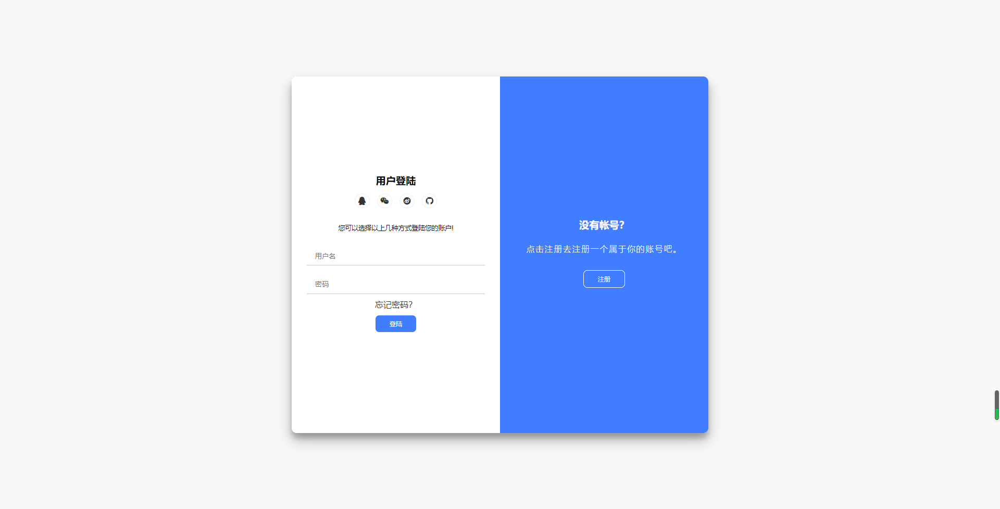

# login_template

#### 介绍
一个优美的登录注册模板

#### 软件架构
软件架构说明

#### 安装教程

1.  git clone https://gitee.com/i_cherry/login_template.git
3.  或者直接下载

#### 使用说明

##### 整体布局

- 采用flex以及rem布局，也可以按需添加需要使用的输入框。

##### 逻辑实现

- 采用对整个container盒子进行类名的动态添加触发css中写好的样式的效果。 

#### 参与贡献

1.  Fork 本仓库
2.  新建 Feat_xxx 分支
3.  提交代码
4.  新建 Pull Request

#### 特技

